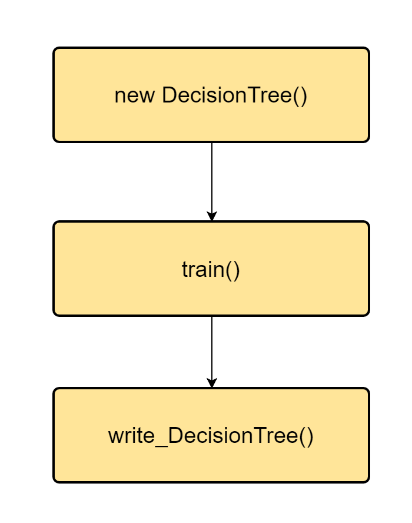
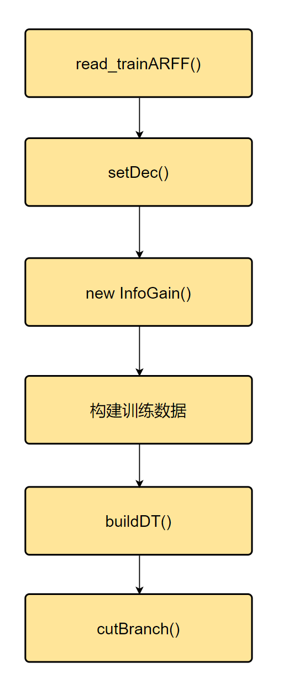

# 白盒测试测试报告

## 1. 实验目的

通过简单程序[白盒测试](http://www.ttfanwen8.com/baiheceshishiyanbaogao/)，熟悉[测试](http://www.ttfanwen8.com/info_21/fw_3416892.html)过程，对[软件测试](http://www.ttfanwen8.com/info_21/fw_3416891.html)行程初步了解，并养成良好的测试习惯。熟练掌握如何运用基路径测试方法进行测试用例设计,初步熟悉如何利用程序插装技术进行逻辑覆盖率分析。

## 1. 源代码

### 1.1 功能

​	选用的代码是决策树。

​	通过`outlook`, `temperature`, `humidity`, `windy` 来决定是否`play`。

```java
@relation weather.symbolic
@attribute outlook {sunny,overcast,rainy}
@attribute temperature {hot,mild,cool}
@attribute humidity {high,normal}
@attribute windy {TRUE,FALSE}
@attribute play {yes,no}
```


### 1.2 文件

项目中最重要的源文件有三个：

```
DecisionTree.java
InfoGain.java
TreeNode.java
```

其中`DecisionTree.java` 是顶层文件，`InfoGain.java` 和 `TreeNode.java` 作为底层类被 `DecisionTree.java` 调用。

#### 1.2.1 `DecisionTree.java`

##### 1. `DecisionTree.java`的大致架构如下：




其中:

- `write_DecisionTree()` 为将训练结果持久化进文件的函数，不涉及源代码内其他函数的调用。这里不用图像赘述。

- `train()`为训练代码

2. ##### `train()` 的大致架构如下：



其中：

- `read_trainRAFF()` 为读取arff文件，给attribute、attributevalue、data赋值， 此处同样不再赘述。
- `setDec()` 为设置决策变量的函数，此处也不再赘述。
- `new InfoGain()` 是为当前决策树新建了一个 `InfoGain`类，这部分将在后面提到。
- 构建训练数据部分为通过`read_trainRAFF`中读到的文件来构建已知的attributevalue和data等，同样没有更深入的函数调用。
- `buildDT()`用来构建决策树，会在下面详细说明。
- `curBranch()` 是剪枝函数，会在下面详细说明。